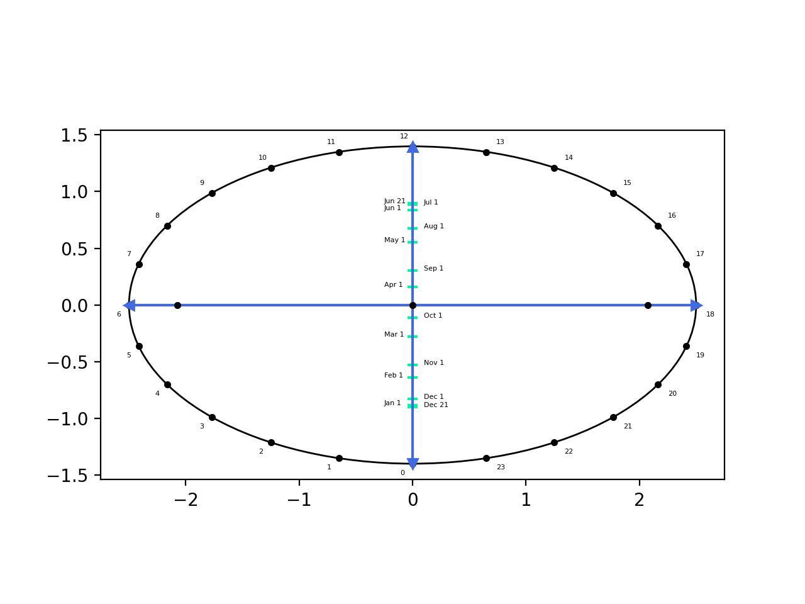

# sundialy
[](https://badge.fury.io/py/sundialy)
[](https://github.com/AttackingOrDefending/sundialy/actions/workflows/tests.yml)
[](https://github.com/AttackingOrDefending/sundialy/actions/workflows/build.yml)
[](https://github.com/AttackingOrDefending/sundialy/actions/workflows/mypy.yml)
[](https://codecov.io/gh/AttackingOrDefending/sundialy)
[](https://sundialy.readthedocs.io/en/latest/?badge=latest)

A sundial library for python. Create an analemmatic sundial in less than 5 minutes.

## Installing

Download and install the latest release:

    pip install sundialy

## Features

* Includes mypy typings

* Create a sundial
```python
from sundialy import AnalemmaticHorizontal

# An analemmatic sundial for Los Angeles.
sundial = AnalemmaticHorizontal(latitude=34, longitude=-118)
```

* View how it will look

```python
sundial.create_sundial("sundial.jpg")
```


* Use the tools
  - SPA (Solar Position Algorithm)
  - SAMPA (Solar and Moon Position Algorithm)
  - SOLPOS (Solar Position and Intensity)
  - Bird (Bird Clear Sky Model)
```python
from sundialy.tools import SPA

spa_results = SPA(2020, 12, 31, 23, 59, 59, 0, 0, 0, 0, pressure=1000, temperature=10, omega=0, gamma=0)
```


## License
sundialy is licensed under the MIT License. Check out LICENSE for the full text.
